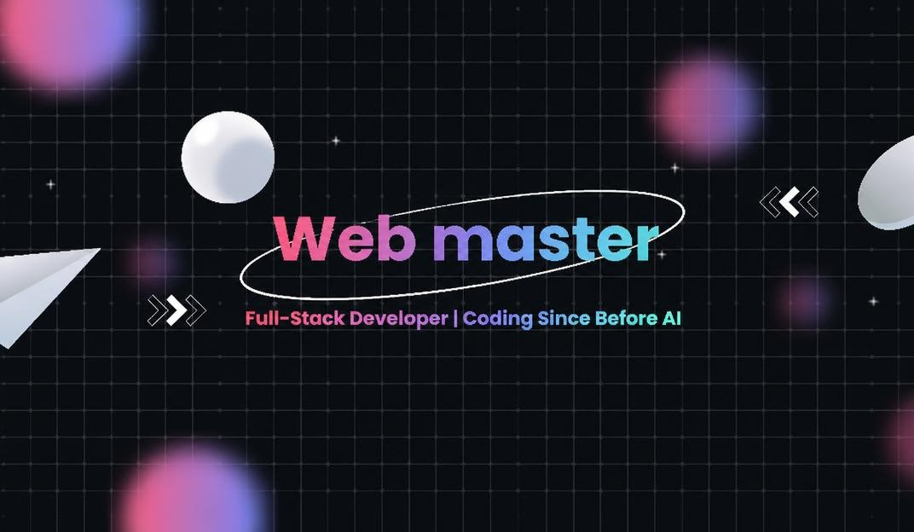

  

<h1 align="center">👋 Hey, I'm Web Master!</h1>

<h3 align="center">
  🚀 Full-Stack Developer | Node.js • Python • React
</h3>

  <strong>
    💡 Turning complex ideas into scalable, high-performance digital solutions.
  </strong>

 <h2>👨‍💻 About Me</h2>

  I'm a passionate <strong>Full-Stack Developer</strong> focused on building
  modern web applications, designing robust backend architectures, and
  crafting intuitive user experiences.

  I enjoy solving challenging problems, writing clean and maintainable code,
  and continuously exploring new technologies to build software that makes
  a difference.

<h2>🛠️ Tech Stack &amp; Expertise</h2>

<ul>
  <li>⚛️ <strong>Frontend:</strong> React, JavaScript, HTML5, CSS3</li>
  <li>🟢 <strong>Backend:</strong> Node.js, Python, REST APIs</li>
  <li>🗄️ <strong>Databases:</strong> SQL &amp; NoSQL Technologies</li>
  <li>🏗️ <strong>Engineering:</strong> API Design, Clean Architecture, Scalable Applications</li>
  <li>🎨 <strong>UI/UX:</strong> Design Systems, Responsive Design, Component-Based Development</li>
  <li>🔧 <strong>Tools:</strong> Git, GitHub, Testing, Debugging</li>
</ul>

<h2>💼 What I Bring to the Table</h2>

<ul>
  <li>🚀 Building end-to-end web applications, from concept to deployment</li>
  <li>🧠 Solving complex technical challenges with practical, maintainable solutions</li>
  <li>⚡ Developing performant, secure, and scalable backend services</li>
  <li>🎯 Creating intuitive interfaces and consistent design systems</li>
  <li>🤝 Collaborating on projects and contributing to open-source initiatives</li>
  <li>📚 Continuously learning and exploring modern engineering practices</li>
</ul>

<h2>🌟 My Engineering Philosophy</h2>

<blockquote>
  Great software isn't just about writing code — it's about solving the right
  problems, building for the future, and creating meaningful experiences.
</blockquote>

<h2>🤝 Let's Connect &amp; Build Something Great!</h2>

  💻 Open to interesting projects, collaboration, and opportunities to build
  impactful products.

  <strong>🚀 Think. Build. Optimize. Repeat.</strong>

## Tech Stack

### Languages:

  
  
  
  
  
  
  

### Libraries & Frameworks:

  
  
  
  
  
  
  
  
  
  
  
  
  
  
  
  
  
  

### Tools & Platforms:

  
  
  
  
  
  
  
  
  
  
  
  
  
  
  
  
  
  
  
  
  

### Databases:

  
  
  
  
  
  
  
  
  
  

